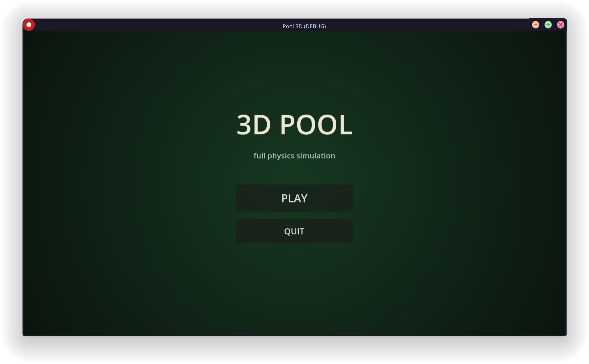
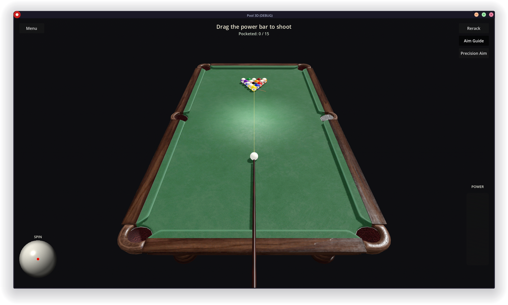

# Pool 3D

A physically simulated 3D pool game built in Godot 4.




## Features

- Custom billiards physics (rolling friction, elastic ball collisions, cushion
  reflection, pocket capture) running on Jolt Physics
- Eight-ball and nine-ball rule sets, including fouls, scratches, and
  ball-in-hand
- AI opponent
- Aim guide / precision aim assist and spin control
- Configurable table profiles, settings menu, and shot recorder

## Requirements

- [Godot 4.7](https://godotengine.org/) (uses the Mobile rendering method and
  Jolt Physics)

## Running

```sh
godot --path . scenes/MainMenu.tscn
```

Or open the project in the Godot editor and press Play.

## Tests

```sh
godot --headless --path . --script tests/run_headless.gd
```

See [tests/README.md](tests/README.md) for details on the physics
calibration suite.

## Assets

The pool table model (`assets/models/traditional_pool_table/`) is
"Pool Table Traditional" by [fizyman](https://sketchfab.com/fizyman),
licensed under [CC BY 4.0](https://creativecommons.org/licenses/by/4.0/).
See `ATTRIBUTION.md` alongside the model for the full credit line.
